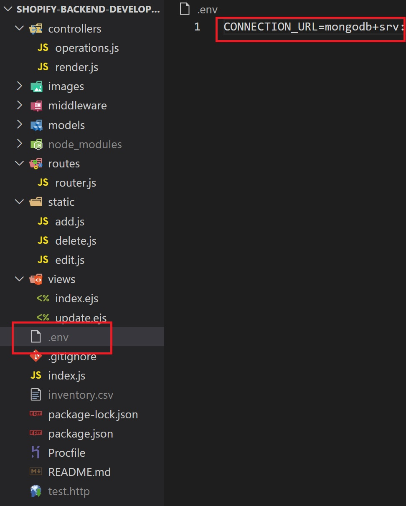
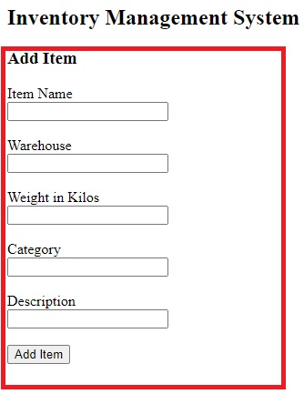
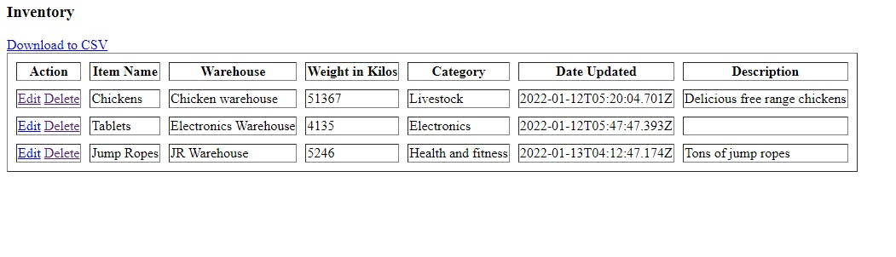
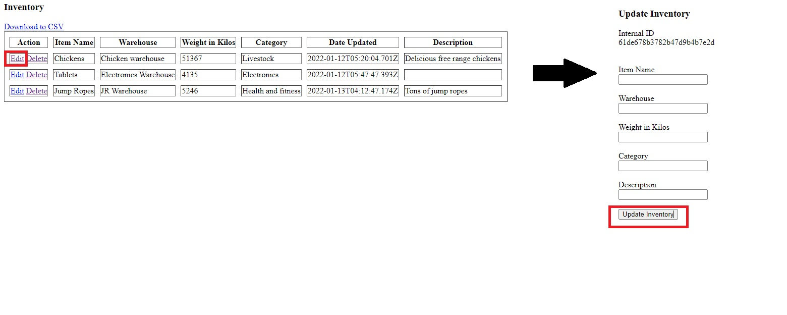
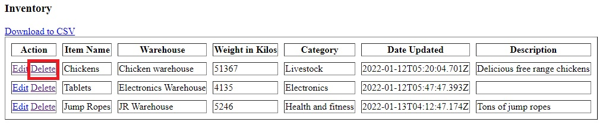
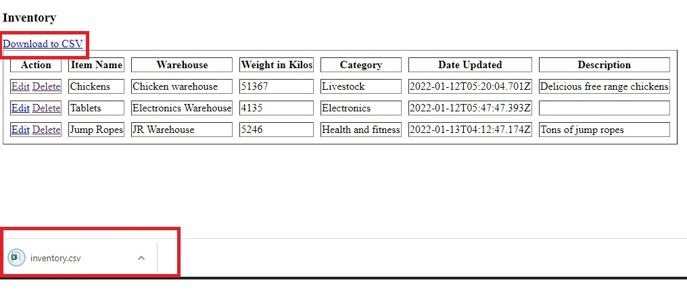

# Shopify Backend Developer Intern Summer 2022

[Link to application](https://shopify-2022-backend-intern.herokuapp.com/)

[Link to technical requirements](https://docs.google.com/document/d/1SSGX4y3vQUV3jLH-CY1kjEtV3eOeZrKPX5anSEyP4T8/edit)

<br />

A web application using NodeJS, ExpressJS, MongoDB, and EJS that supports CRUD (Create, Read, Update, and Delete) functionality for a logistics company.

<br />
This application is also able to perform the following additional feature:

- Push a button export product data to a CSV

<br />

## Instructions

### Running Locally

While a live demo is deployed on Heroku in the link listed above, you can also run the application locally. The only prerequisites are having Node installed and having a MongoDB database set up. Assuming you have Node installed, clone the repository. Copy the following command into your terminal.

```
git clone https://github.com/colischeng/Shopify-Backend-Developer-Intern-Summer-2022.git
```

On the live demo, a MongoDB database is already connected because Heroku lets you define environment variables. For security, my .env and therefore personal MongoDB link is not tracked by Git. Locally, you would need to create a .env file and list a MongoDB CONNECTION_URL as shown below



Once that is all set up, simply start the program by running the following scripts.

```
npm install
npm start
```

Now onto the actual functionality:

<br />

### Create

Fill in the fields and then click the "Add Item" button. "Item Name", "Warehouse", "Weight in Kilos", and "Category" are all required fields, whereas "Description" is an optional field.



Once all required fields are included and you click "Add Item", the browser will provide an alert as to whether or not adding to the database was successful.

<br />

### Read

By default all records are automatically loaded onto the homepage. As you create, update, and delete entries into the database, this list will show any necessary changes.



<br />

### Update

To update an existing entry, click the "Edit" link right next to that entry. At that point, you will be redirected to a new screen that will allow you to update any or all fields in that given entry. Any fields that are left empty in the "Update Inventory" page will remain unchanged in the database.



Once you have filled all desired fields to be changed and click "Update Inventory", the browser will provide an alert as to whether or not editing the entry was successful.

<br />

### Delete

To delete an entry, click the "Delete" link right next to that entry. The database will be updated to reflect this change.



The browser will provide an alert as to whether or not deleting from the database was successful.

<br />

### Export to CSV

To download the database into CSV format, simply click "Download to CSV".



At that point, a file named "inventory.csv" will be automatically downloaded which will include all entries from the database.
